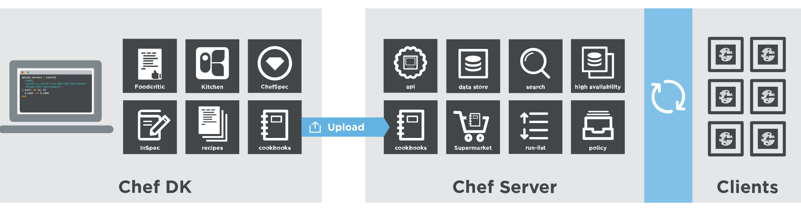
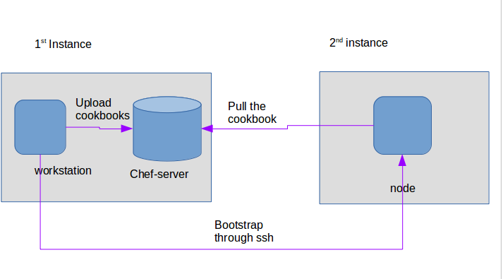
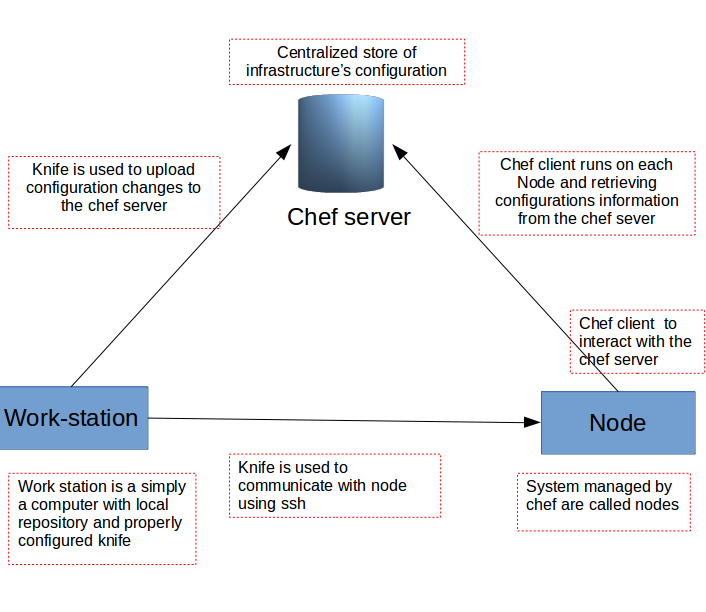

## WSO2 API Manager 2.2.0 
## [DEPRECATED] Chef Cookbook

Chef is a powerful automation platform that transforms infrastructure into code.The Chef Server acts as a hub for configuration data. The Chef Server stores cookbooks, the policies that are applied to nodes, and metadata that describes each registered node that is being managed by Chef. 

Many organizations, in distributing nodes between multiple servers,  encounter the challenge of how to do configurations that are consistently deployed. It is easy if it is to manage one to ten servers manually but it is difficult when managing several servers. There the role of Chef comes into play. With Chef, we are able to manage servers, whether it is 5 or 5,000 of them– by turning our infrastructure into code. Time-consuming activities such as manual patching, configuration updates and service installations for every server will no longer exist. Apart from those, our Infrastructure becomes flexible, version-able, human-readable, and testable.

Here the  Chef cookbook includes the installation and  configurations for distributed setup with different profiles such as  distributed database configuration, enable clustering, standalone h2 database configurations, API manager configuration, axis2 configuration,registry confi, user management configurations for WSO2 API manager.

**An Overview of Chef Components**
The Chef process consists of three core components that interact with one another: Chef server, actual servers called nodes, and Chef workstation.Here is a short summary of main parts of Chef architecture:

- **Chef Server**: Centralized server that holds all of your nodes' configuration. It can be self-hosted or hosted by Chef (the company).
- **Node**: Hosts to which recipes and roles are applied during Chef client run. The primary features of a node are its - attributes and run list.
- **Cookbooks**: Contain all resources and instructions that you need to configure your nodes. These can be reused across different run lists. Cookbooks typically consist of many recipes.
- **Recipe**: The fundamental part of Chef, it is a collection of resources that are executed in the order to configure a node.
- **Resource**: A cross platform abstraction of configurable parts of a node. For example these could be users, packages, files or directories.
- **Attributes** - Represent node settings, for example hostname, versions of programming languages to install, database server etc.
- **Data bags**: Contain globally available data used by nodes and roles.
- **Chef Client**: Does all work on behalf of a node, where it executes recipes to configure and install software.
- **Chef Repository**: The place where cookbooks, roles, configuration files, and other artifacts live.
- **Chef Solo**: A command line tool that allows you to run Chef cookbooks without an actual Chef server. It is an open source version of the Chef client.
- **Knife**: A tool used by engineers to upload configuration changes to the Chef server.
- **Ohai**: A tool for collecting data about your operating system, used to provide system attributes used by Chef client during Chef run.
- **Role**: A way to group similar features of nodes, for easier management.
For more deatails (https://docs.chef.io/chef_overview.html)

### How to Contribute

This guide provides step by step instructions to configure Chef setup to run the WSO2 products.
Note :
      : Tested Operating System 
      - Ubuntu 16.04

This document contains instructions specific to ubuntu 16.04 .

#### Instructions

  1. Setup two instances
     - Chef workstation and Chef server can be a one instance because Chef workstation is accessing the Chef server(uploading cookbooks to the server by workstation).you can also use separate  instances to Chef server and  Chef workstation.But it is better when we use same instance for both because user.pem file and validation.pem file save on Chef-server instance.
       Set one  instances as Chef server as well as Chef workstation and other as Chef-client. You must be able to SSH between both the instances if bootstrapping the node from workstation.A bootstrap is a process that installs the chef-client on a target system so that it can run as a chef-client and communicate with a Chef server. Bootstraping through SSH is might not be possible in more than half of the cases, for security reasons.so we directly bootstraping the node  with chef server through the validation.pem file by downloading chef-client in node.
            
 
  2. Setup Chef server, Chef client  and workstation and Perform the configurations part to run the product
     - First, we install the Chef Server and Chef workstation in one instance and do the configuration part for them. 
 Thereafter, we install the Chef client in another instance and configure both  chef server and chef node and also we configuration of Chef workstation and Chef node is carried out if bootstrapping the node from workstation.
 
 

##### **2.1.Install and configure Chef Server** 
We can install the Chef Server through this link 
(https://learn.chef.io/modules/manage-a-node-chef-server/ubuntu/bring-your-own-system/set-up-your-chef-server#/)
 
When we install the Chef Server in an instance we have to create an organization and user. In this process you get RSA private key for the user. You need to save the USER.pem (chefadmin.pem) file into a seperate file for knife configuration process.

##### **2.2.Install and configure Chef workstation**
Chef-workstation can be  installed through Chef Development Kit (Chef DK) via  this link (https://downloads.chef.io/chefdk).
Refer this link to the configuration part of workstation (https://docs.chef.io/workstation.html).
When you go through the above  doc you will  find two ways to create the Chef-repo:
1. Use the starter kit built into the Chef Server web user interface
2. Manually, by using the chef generate app subcommand in the chef command-line tool that is packaged in the Chef Development Kit

First one is the easiest method when you have access to Chef server (hosted or on premises). There you can download the starter kit. The starter kit will create the necessary configuration files: Chefdirectory, knife.rb, ORGANIZATION-validator.pem, and USER.pem. Simply download the starter kit and then move it to the desired location on your workstation. 
In the second method, we have to do it manually by creating those files.

After doing the configuration part through [1](https://docs.chef.io/workstation.html) link 
1.Download the chef-apim-master.zip from the (https://github.com/tharmini/chef-apim)
2.Extract the zip file and copy the chef-wso2apim folder from chef-apim-master to ~/chef-repo/cookbooks/

3.Now we can upload that  into the Chef-Server by following command in the ~/ chef-repo directory

    knife cookbook upload chef-wso2apim
Now we can find the output as below:

    Uploading chef-wso2apim  [0.1.0]
    Uploaded 1 cookbook.

#### How to further edit the cookbook

 
- If we want to create a recipe go to ~/chef-repo/cookbooks/chef-wso2apim/  directory and type the following command:
	
	    chef generate recipe RECIPE_NAME
  Now the newly created recipe is included inside the recipes folder
	
 - If we want to create a template, go to ~/chef-repo/cookbooks/chef-wso2apim/  directory and type the following command:
	
	    chef generate template TEMPLATE_NAME
    Now we the newly created template is included inside the templates folder.

- If we want to change the attribute of  templates
	- create a .erb file in templates folder 
		For eg: 
        Chef generates template carbon.xml
		It will create an axis2.xml.erb file in templates folder
	- Edit the configurations inside the carbon.xml.erb file by defining dynamic attribute name
		For eg: node["wso2am"]["server_ports_offset"]
	- Define the dynamic static attributes  in default file inside the attribute folder
 	 ~/chef-repo/cookbooks/chef-wso2apim/attributes/default.rb file and add the template file 
	For eg: default["wso2am"]["server_ports_offset"] = 1
   - For template file we have to mention source template that will be used to create the file, and the permissions needed on that file.

We have to add the source  and destination path  into default["templates"] in default.rb inside  attributes folder. 

- If we want to create a new cookbook go to ~/chef-repo/cookbooks/ directory and type the following command
	
	    chef generate cookbook COOKBOOK_NAME
   Now the newly created COOKBOOK is included inside the cookbooks folder.

- If we want to upload files which are below  250mb size, we can directly insert that file into ~/chef-repo/cookbooks/chef-wso2apim/files/ directory. But if the file size is above the 250mb we want to put that file into an external server. We have to change the external server link in attributes file.
In the above cookbook the external server store the wso2am-2.2.0 and jdk1.8.0_121
packs. If we want to change that version we need to store the newly version packs in external   server and change the  default attribute default['wso2am']['java_file_cache_path'] , default['wso2am']['wso2am_file_cache_path'] and the default['wso2am']['product_version'].
	
When we made changes in cookbook we have to upload the cookbook again into the Chef Server through the previous command in step 3.
	
##### **2.3.How to install and configure Chef-client**
A bootstrap is a process that installs the Chef-client on a target system so that it can run as a Chef-client and communicate with a Chef Server. There are two ways to do this:
1. Use the knife bootstrap subcommand to bootstrap a node using the omnibus installer
2. Use an unattended install to bootstrap a node from itself, without using SSH or WinRM

**2.3.1.Use the knife bootstrap subcommand to bootstrap a node using the omnibus installer**

Through this method, the workstation bootstraps the node through SSH command and push the cookbook from the Chef Server to the node. When using bootstrapping method the node machine doesn’t need to install Chef client. It will automatically install and configure all the functions.
To do this we can be able to SSH with two instances .
We can install the open-SSH server with the following commands
        
        sudo apt-get update
        sudo apt-get install openssh-server

To SSH into the guest VM, first you have to set the forwarded port in VM.(https://blog.johannesmp.com/2017/01/25/port-forwarding-ssh-from-virtualbox/)

**2.3.2.Use an unattended install to bootstrap a node from itself, without using SSH or WinR**

In this way in our Chef-client instance we must install the Chef client and do the configuration parts of it. Here the node doesn’t need to connect with the workstation only the chef server.To install Chef Client on a machine go to the URL (http://www.getchef.com/chef/install/). Select your Operating System, Version and Environment. It will show you the link to download the relevant package.On Linux you can install through the installer script.The script will download and install the latest version of Chef client on your machine. 

Follow this link to do the configurations  on Chef-client. (https://medium.com/@tharmini7/chef-client-2eab9a45f10d)
NOTE:
In WSO2-APIM 2.2.0, for deployment purpose database connection need with the host system.So before running the cookbook first connect the node instance with host system database.
In the host system open the terminal and type the following command:
            
        Mysql -u root -p;
        ALTER USER ‘username’@’%’ IDENTIFIED BY ‘password’;
        Flush privileges;
        grant all on *.* to ‘root’@’%’;
        Flush privileges;
In the node instance type the following command to check is the database connected or not
        
        mysql -h ' IPPADDRESS_OF_HOST' -u 'MYSQL_USERNAME' -P 'MYSQL_PASSWORD'
        
        
